# Terraform Demo: AKS + VNet + NSG

This project deploys with **Terraform** an **Azure Kubernetes Service (AKS)** cluster inside a **Virtual Network (VNet)** protected with a **Network Security Group (NSG)**.

---

## 📂 File structure

```
terraform-aks-demo/
├─ versions.tf               # Terraform and provider versions
├─ main.tf                   # Resources: RG, VNet, Subnet, NSG, AKS
├─ variables.tf              # Parameterized variables
├─ outputs.tf                # Deployment outputs
├─ terraform.tfvars.example  # Example of input variables
├─ backend.tf                # (optional) Remote state in Azure Storage
└─ .gitignore                # Ignore tfstate, .terraform/, etc.
```

---

## 🚀 Deployed resources

* **Resource Group**
* **Virtual Network (VNet)** with **dedicated subnet** for AKS
* **Network Security Group (NSG)** with standard rules:

  * Allow VNet inbound/outbound
  * Allow Azure Load Balancer inbound
  * Deny everything else
* **AKS Cluster** with:

  * `default_node_pool` of type VMSS
  * Networking based on Azure CNI (`network_plugin = "azure"`)
  * RBAC enabled
  * Optional: OIDC issuer and Workload Identity

---

## ⚠️ Common errors found and solutions

### 1. **Unregistered Resource Providers**

```
Error: Encountered an error whilst ensuring Resource Providers are registered.
waiting for Subscription Provider ... Microsoft.DBforMySQL ...
```

✅ **Solution**: Manually register the providers used by AKS:

```powershell
$providers = @("Microsoft.Network","Microsoft.Compute","Microsoft.ContainerService","Microsoft.DBforMySQL")
foreach ($p in $providers) { az provider register -n $p }
```

---

### 2. **Quota exceeded (0 vCPU allowed)**

```
SubscriptionIsOverQuotaForSku: Quota exceeded for : 0 VMs allowed, 1 VMs requested.
```

✅ **Solution**:

* Change region in `terraform.tfvars` (`location = "eastus2"` → another region with available vCPUs).
* Or request a quota increase from the Azure Portal.

---

### 3. **Availability Zone error**

```
AvailabilityZoneNotSupported: The zone(s) '3' ... Supported zones for location 'eastus2' are '2,1'
```

✅ **Quick fix applied**: adjust `terraform.tfvars`:

```hcl
availability_zones = ["1", "2"]
```

---

## 🪣 Backend configuration in Azure Storage

The Terraform state is stored in Azure Storage for team collaboration.

### 1. Create Storage Account

```powershell
$RG_STATE="rg-tfstates"
$LOC="eastus2"
$STG="sttfdemoxxxxx"   # globally unique name
$CONTAINER="tfstate"

az group create -n $RG_STATE -l $LOC
az storage account create -g $RG_STATE -n $STG -l $LOC --sku Standard_LRS
az storage container create --name $CONTAINER --account-name $STG
```

### 2. backend.tf

```hcl
terraform {
  backend "azurerm" {
    resource_group_name  = "rg-tfstates"
    storage_account_name = "sttfdemoxxxxx"
    container_name       = "tfstate"
    key                  = "aks-demo/terraform.tfstate"
  }
}
```

### 3. Export access key in PowerShell

```powershell
$env:ARM_ACCESS_KEY = (az storage account keys list `
  -g rg-tfstates `
  -n sttfdemoxxxxx `
  --query "[0].value" -o tsv)
```

This environment variable export is used **only when you have a remote backend in Azure Storage** defined in your `backend.tf`:

```hcl
terraform {
  backend "azurerm" {
    resource_group_name  = "rg-tfstates"
    storage_account_name = "sttfdemoxxxxx"
    container_name       = "tfstate"
    key                  = "aks-demo/terraform.tfstate"
  }
}
```

---

### 🔹 Why is it needed?

The `azurerm` backend requires credentials to read/write the **Terraform state** in the Storage Account.
Terraform automatically recognizes the environment variable `ARM_ACCESS_KEY` as the **storage access key**.

---

### 🔹 When is it used in the flow?

In the **`terraform init`** step:

```powershell
terraform init
```

When Terraform initializes the backend, it uses `$env:ARM_ACCESS_KEY` to authenticate to the Storage Account `sttfdemoxxxxx`.
If you don’t set this variable (or don’t have Managed Identity auth), `terraform init` will fail with a credentials error.

---

👉 In short: **this export only applies if you’re using `backend.tf` with remote state in Azure Storage**.
It’s not used for deploying resources (AKS, VNet, NSG), but for **Terraform state management**.

---

## 🛠️ Step-by-step to deploy the cluster

### 1. Authenticate to Azure

```powershell
az login
az account set --subscription "<SUBSCRIPTION_ID>"
```

### 2. Initialize Terraform

```powershell
cd terraform-aks-demo
terraform init
```

### 3. Review the plan

```powershell
terraform plan -var-file="terraform.tfvars.example"
```

### 4. Apply changes

```powershell
terraform apply -var-file="terraform.tfvars.example" -auto-approve
```

### 5. Get AKS credentials

```powershell
$rg  = terraform output -raw resource_group_name
$aks = terraform output -raw aks_name

az aks get-credentials --resource-group $rg --name $aks
```

### 6. Validate the cluster

```powershell
kubectl get nodes -o wide
kubectl get pods -n kube-system -o wide
```

---

## 🔍 Resources visible in a clean cluster

In `kube-system` you should see:

* **coredns**
* **kube-proxy**
* **azure-ip-masq-agent**
* **azure-cni pods**
* **metrics-server** (if enabled)
* **omsagent/ama-**\* (if monitoring enabled)

---

## 🧹 Cleanup

To remove all resources:

```powershell
terraform destroy -var-file="terraform.tfvars.example" -auto-approve
```

---

## ✅ Conclusions

* The project deploys a complete **basic production-ready AKS infrastructure** with networking and security.
* We ran into issues with **unregistered providers**, **quotas**, and **availability zones**, all solved.
* The infrastructure is ready to extend with **ACR**, **monitoring add-ons**, or **additional node pools**.

---

## Infrastructure deployment visualization

### 1) Deployment of the storage account to store Terraform logs.

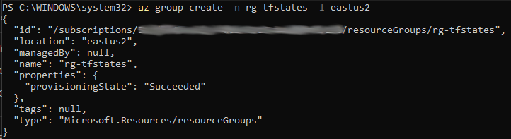
\- Creation of the resource group.

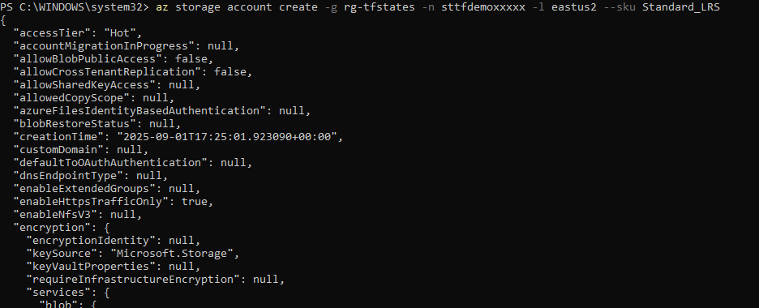
\- Creation of the Storage Account in the previously created RG.

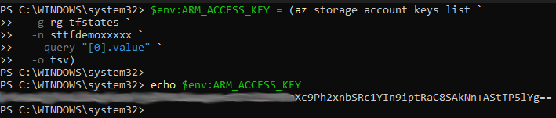
\- Configuring the storage account access key as an environment variable.

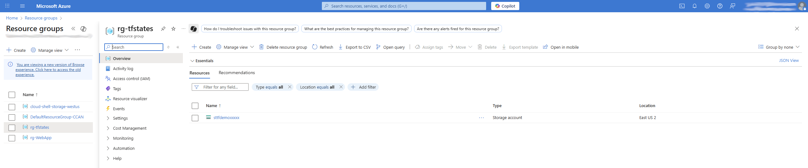
\- Azure GUI showing the deployed resource.

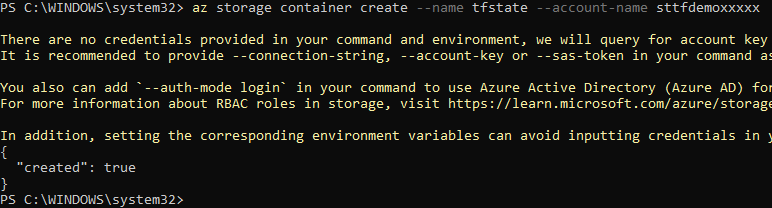
\- Creation of the container inside the storage account.


\- GUI view of the container in Azure.

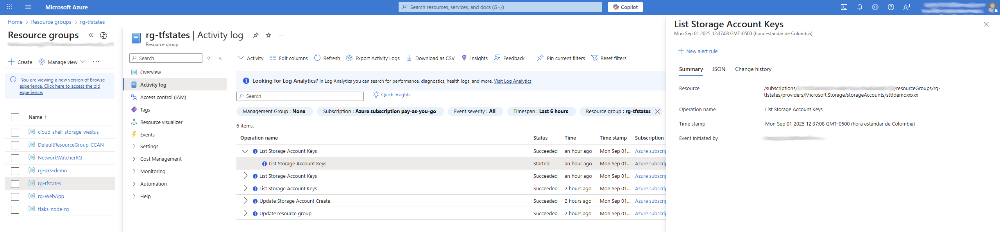
\- Here you can see the logs being stored from Terraform events.

### 2) Deployment using Terraform

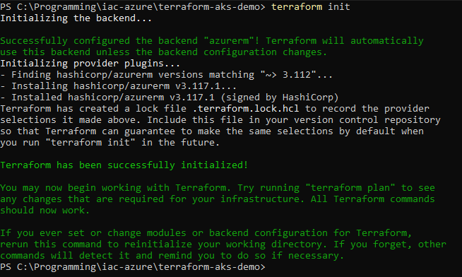
\- Command to initialize the deployment and download the providers.

Then the Terraform plan command is applied:

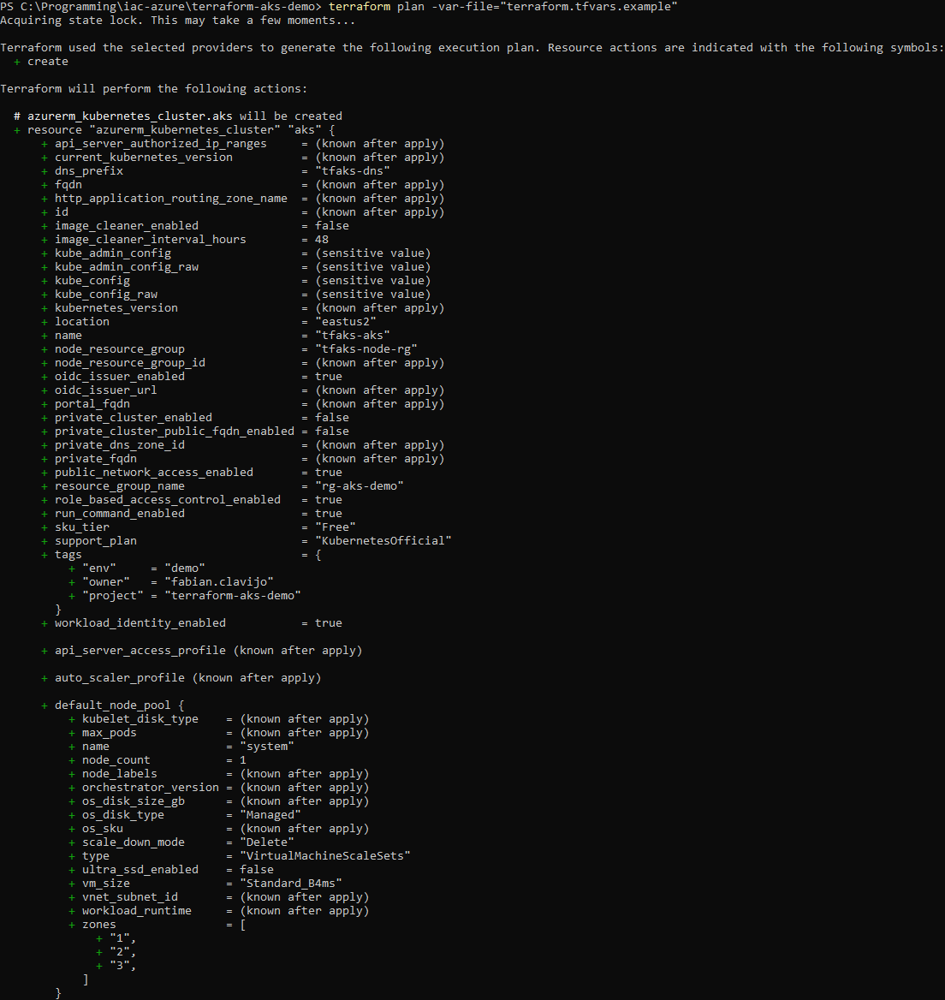

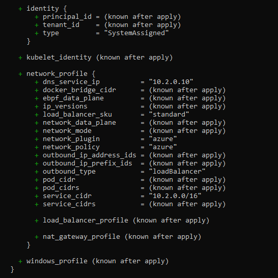

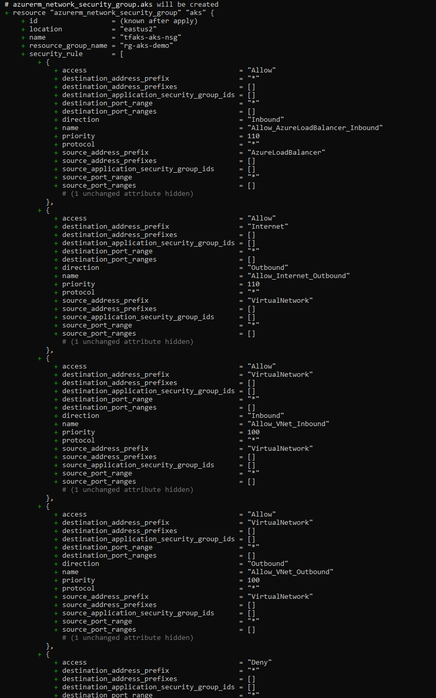


Then run terraform apply command:

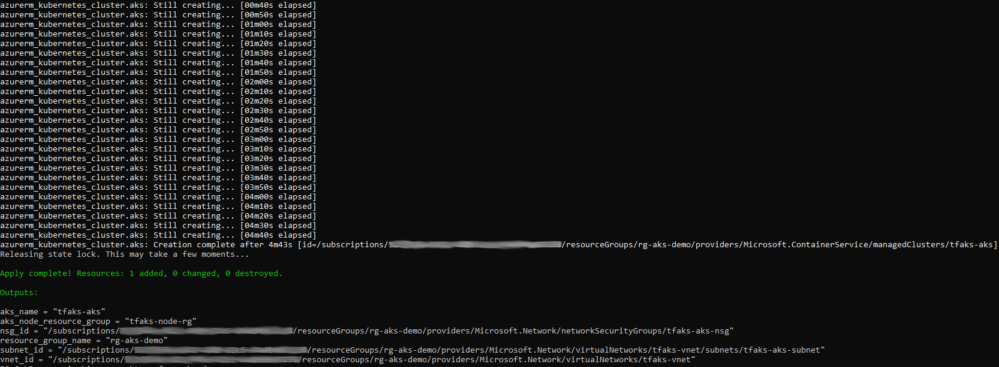
\- End of success message in the console after deploying the cluster.

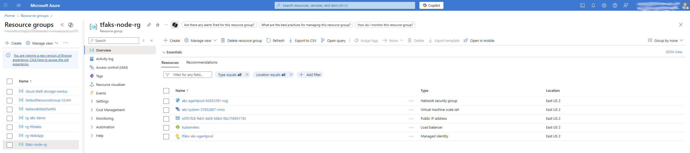
\- Resources deployed to support the cluster.

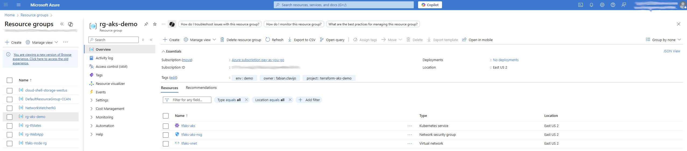
\- AKS cluster deployed and functional.

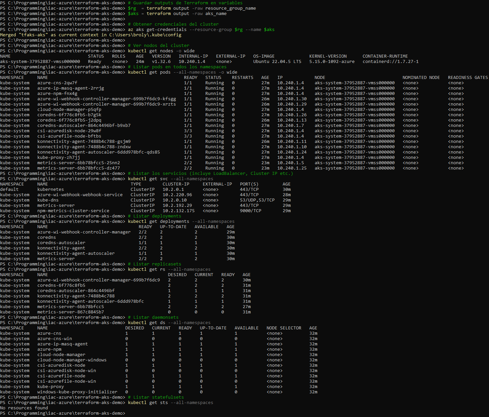
\- Some kubectl commands to show the running cluster.

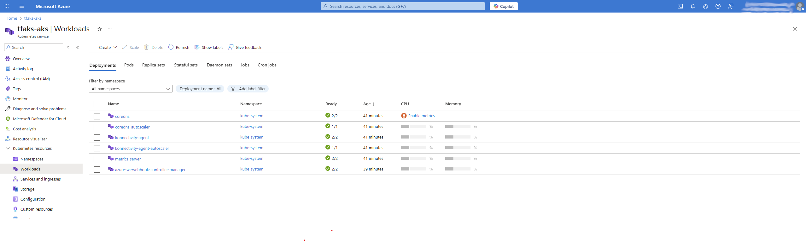
\- Deployments visualized on Azure GUI.

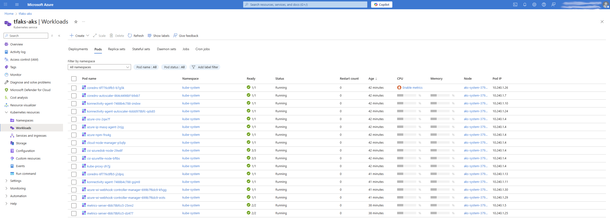
\- Pods visualized on Azure GUI.