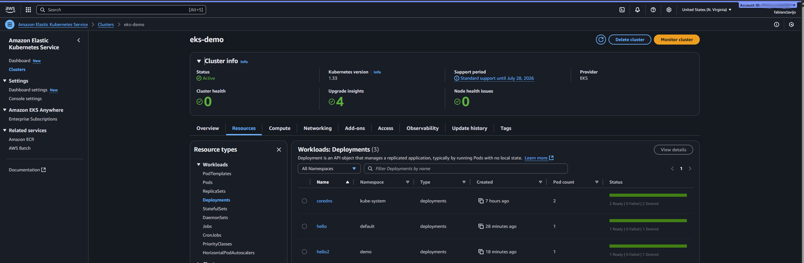
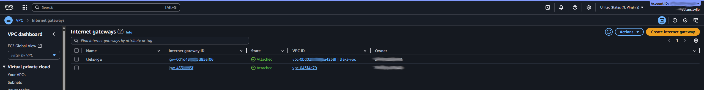

# Terraform EKS Cluster

This project provisions a **basic Kubernetes infrastructure on AWS using Terraform**, with a remote backend for state management. It includes networking, security, IAM roles, and a fully functional Amazon EKS cluster ready to run workloads.

---

## AWS Components

### Remote Backend (S3 + DynamoDB)

* Terraform state is stored securely in an **encrypted S3 bucket**.
* **Optional DynamoDB table** is used to implement state locking, preventing concurrent executions and ensuring safe collaboration.

### AWS Provider & Versions

* Requires **Terraform ≥ 1.6**.
* Uses the official **AWS provider 5.x**.
* The region is defined via the `aws_region` variable.

### Networking

* **VPC**: Isolated network with DNS support and configurable CIDR block.
* **Internet Gateway**: Provides connectivity between the VPC and the internet.
* **Public Subnet**: Hosts resources that require public IPs (e.g., external load balancers).
* **Private Subnets (x2)**: Host EKS nodes and internal load balancers, distributed across availability zones.
* **NAT Gateway + Elastic IP**: Enables outbound internet access from private subnets while blocking inbound traffic.
* **Route Tables**:

  * Public routes (`0.0.0.0/0` → Internet Gateway).
  * Private routes (`0.0.0.0/0` → NAT Gateway).

### Security

* **Security Groups**: Enforce inbound/outbound rules for EKS control plane and worker nodes, allowing controlled communication between internal resources and the internet.

### IAM Roles

* Dedicated **IAM roles and policies** for the EKS control plane and worker nodes.
* Permissions aligned with the principle of least privilege.

### Amazon EKS Cluster

* Provisions the **EKS control plane** in private subnets, secured by security groups.
* Defines a dedicated **CIDR range for internal services**.
* Fully integrated with IAM for access control.

### Managed Node Group

* **EC2-based worker nodes** automatically join the cluster.
* Scales dynamically based on the desired configuration.
* Nodes run in private subnets with appropriate IAM permissions.

---

## Component Interactions

* **Networking & Access**: The VPC hosts both public and private subnets. The Internet Gateway exposes public services, while the NAT Gateway ensures secure outbound traffic from private resources.
* **Security**: Security Groups apply fine-grained traffic restrictions, balancing internal communication with controlled internet access.
* **Cluster Integration**: The EKS control plane resides in private subnets; managed EC2 worker nodes connect through IAM roles and security groups.
* **Remote State**: The Terraform state is stored in S3, with DynamoDB ensuring safe, reproducible team deployments.

---

## Prerequisites

* **AWS CLI** configured with valid credentials.
* **kubectl** for cluster interaction.
* **Terraform ≥ 1.6** installed.

---

## Basic Usage

1. Create the **S3 bucket** (and optional DynamoDB table) for Terraform backend.
2. Initialize the Terraform project:

   ```bash
   terraform init -backend-config=...
   ```
3. Plan the deployment:

   ```bash
   terraform plan -var-file="terraform.tfvars.example"
   ```
4. Apply the configuration:

   ```bash
   terraform apply -var-file="terraform.tfvars.example"
   ```
5. Update kubeconfig and validate the cluster:

   ```bash
   aws eks update-kubeconfig --name <cluster_name>
   kubectl get nodes
   ```

   ---

## Deployment Visualization


\- Console print of deployed resources, aplly complete!.


\- GUI visualization of deployments.


\- GUI visualization of deployments.


\- GUI Instances running.


\- GUI of the Internet Gateway.


\- Smoke test doing deployments to the cluster and launching commands.


\- GUI of the NAT gateway.


\- Terraform plan command output.


\- Terraform plan command output.


\- Subnets deployed on this project.


\- Terraform init command output.


\- GUI of the VPC deployed.


\- One Nginx server up and exposed to internet from cluster.